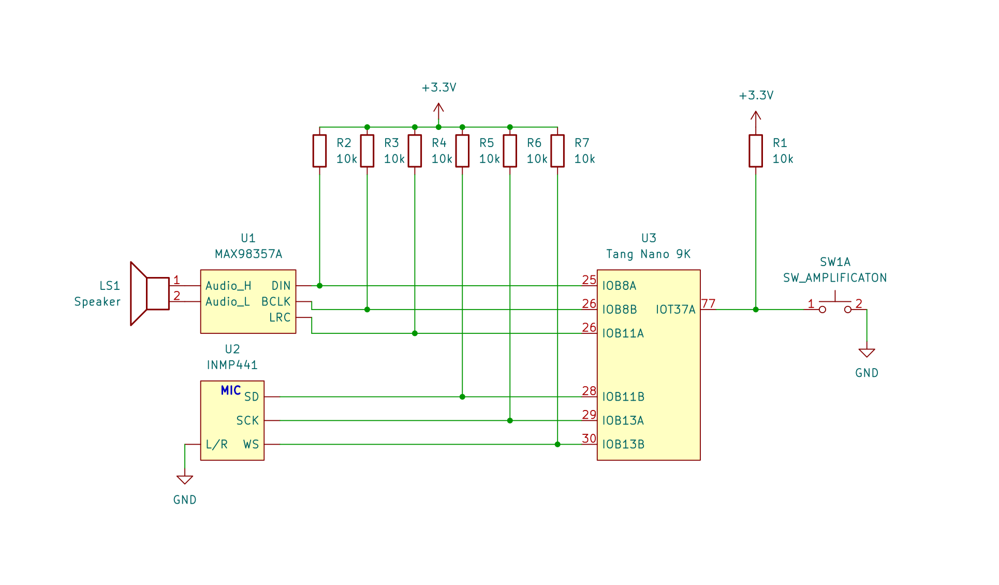
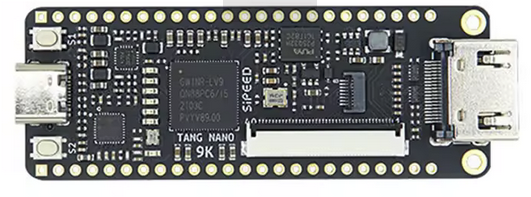
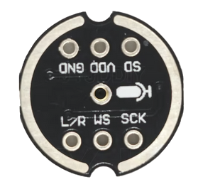
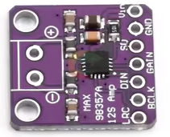

# Tang Nano 9K I2S DSP Audio Pipeline

This project implements a high-quality digital audio processing pipeline on a Sipeed Tang Nano 9K FPGA. It takes audio from an I2S MEMS microphone, processes it through several DSP stages, and outputs it to an I2S DAC.

## Features

- **I2S Audio Input**: Support for INMP441 or similar 24-bit MEMS microphones.
- **I2S Audio Output**: Support for MAX98357A or similar DAC modules.
- **DSP Pipeline**:
  - **Speech Compressor**: Normalizes input levels for consistent speech volume.
  - **Speech Equalizer**: Optimized frequency response for clarity.
  - **Digital Limiter**: Prevents clipping and distortion.
  - **4-Step Volume Control**: Bidirectional volume stepping (0dB to -18dB) with LED status display.
- **Hardware Integration**:
  - Debounced button controls for toggling DSP stages.
  - Visual status indication via onboard LEDs.
  - External volume button support.

##Schematics


##Components
### 1.Sipeed Tang Nano 9K FPGA Board

### 2.I2S Mems Microphone (e.g INMP441)

### 3.I2S Audio Amplifier (e.g MAX98357A)

## Hardware Connections

### Audio Modules
| Module | Pin (Tang Nano 9K) | Description |
| --- | --- | --- |
| **I2S DAC (MAX98357A)** | 26 | BCLK |
| | 27 | LRCLK (WS) |
| | 25 | DIN (SD) |
| **I2S MIC (INMP441)** | 29 | SCK (BCLK) |
| | 30 | WS (LRCLK) |
| | 28 | SD |

### User Interface
| Component | Pin (Tang Nano 9K) | Description |
| --- | --- | --- |
| **Button S1 (Tang)** | 3 | Toggle Compressor |
| **Button S2 (Tang)** | 4 | Toggle Equalizer |
| **Volume Button** | 77 | 4-step Vol (0/-6/-12/-18 dB) |
| **LED 1-3 (Tang)** | 10, 11, 13 | Volume Level indicator |
| **LED 4 (Tang)** | 14 | Equalizer Status (ON = Enabled) |
| **LED 5 (Tang)** | 15 | Compressor Status (ON = Enabled) |

*Note: The Volume Button (Pin 77) and I2S (Pin 25-30) require external 10k pull-up resistors to 3.3V.*

## Volume Control Logic

The volume control uses a "ping-pong" stepping mechanism:
1. **Sequence**: `0dB -> -6dB -> -12dB -> -18dB -> -12dB -> -6dB -> 0dB -> ...`
2. **LED Bar**:
   - `● ● ●` (3 LEDs): 0 dB
   - `○ ● ●` (2 LEDs): -6 dB
   - `○ ○ ●` (1 LED): -12 dB
   - `○ ○ ○` (0 LEDs): -18 dB

## Building and Flashing

This project uses the open-source FPGA toolchain (OSS CAD Suite), which is also available as


### Prerequisites

### 1. Toolchain Installation

This project requires the open-source Apicula (Gowin) toolchain. The fastest way to install all dependencies is via the OSS CAD Suite.

    Yosys: Synthesis

    nextpnr-himbaechel: Place & Route

    gowin_pack: Bitstream generation

    openFPGALoader: Hardware flashing

    Note: Ensure the bin folder of your installation is added to your system $PATH.

#### 2. VSCode Integration

To develop within VSCode, install the following extensions:

    Verilog-HDL/SystemVerilog (Syntax & Linting)

    Tasks (Built-in automation)

#### 3. Build & Flash

The repository includes a .vscode/tasks.json to automate the flow.

    Synthesize & Route: Press Ctrl + Shift + B (runs yosys -> nextpnr -> gowin_pack).

    Flash Hardware: Press Cmd/Ctrl + Shift + P, type Run Task, and select Flash FPGA.


### Build
To synthesize the design and generate the bitstream:
```bash
make all
```

### Load
To flash the bitstream into the volatile SRAM (resets on power loss):
```bash
make load
```

### Flash
To flash the bitstream permanently into the internal flash:
```bash
make flash
```

## Troubleshooting
- **No Sound**: Verify that the microphone and DAC share the same ground. Check if bitstream loaded successfully.
- **Distorted Audio**: Check the I2S wiring length (keep it short) and ensure the 3.3V supply is stable.
- **LEDs logic**: On the Tang Nano 9K, onboard LEDs are **active-low**. The logic in `top.v` accounts for this by inverting the status signals.
